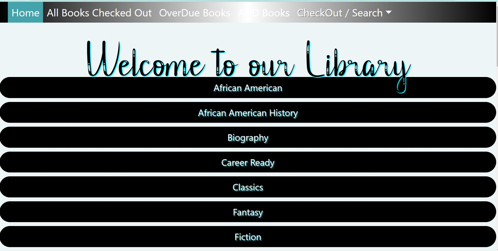
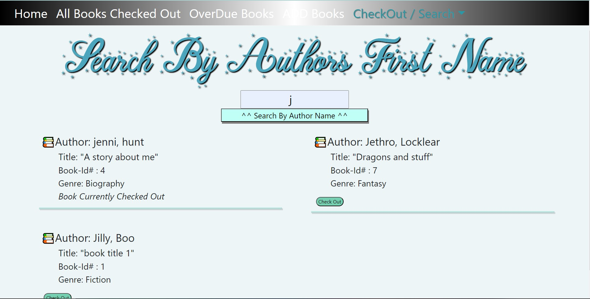
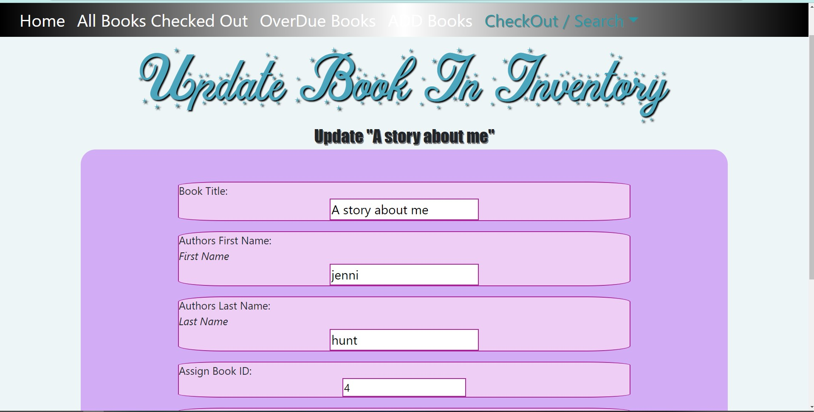
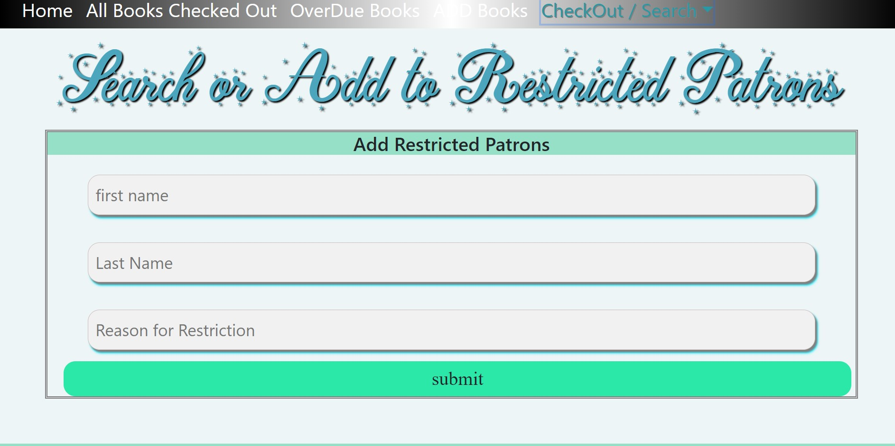
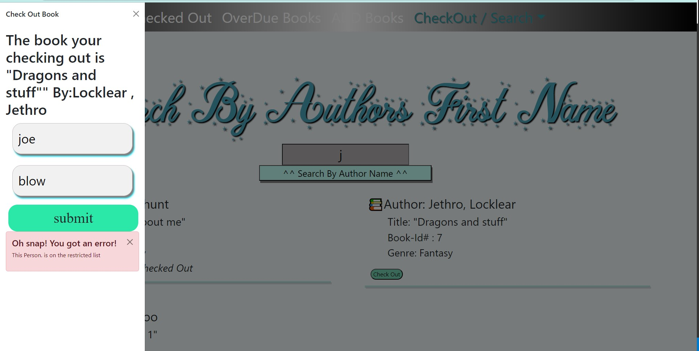
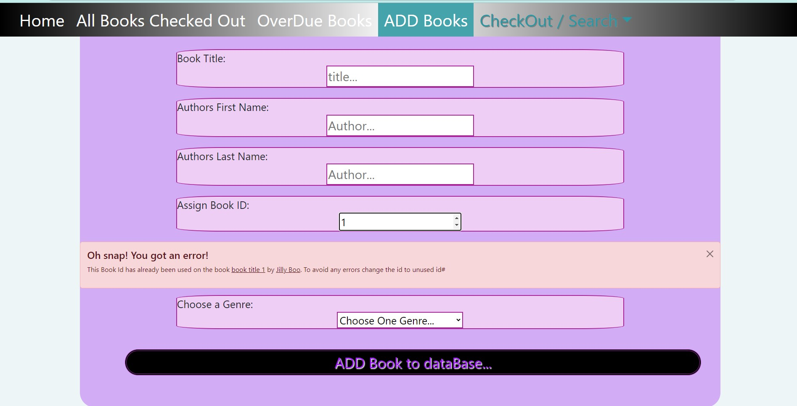
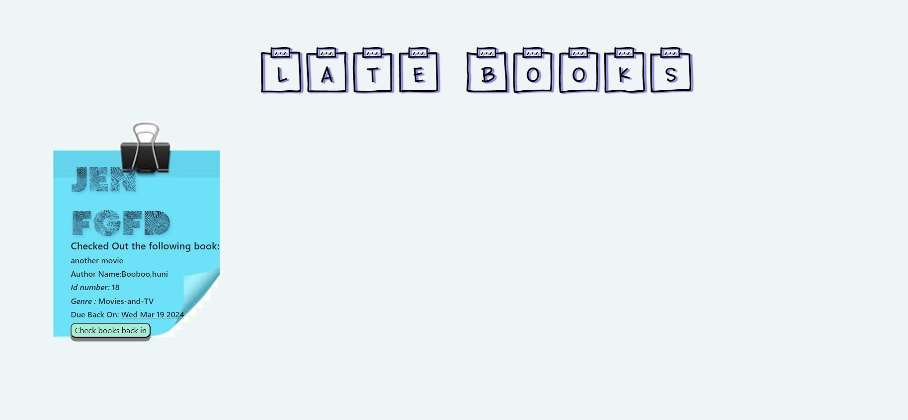

# Library Application
 
# Table of Contents
- [Introduction](#introduction)
- [Application-Examples](#ApplicationExamples)
- [Technologies](#technologies)
- [License](#license)
- [Contributors](#contributors)
- [Installation](#installation)
- [Usage](#usage)
- [Support](#support)
- [Acknowledgements](#acknowledgements)

## Introduction
The creation of this application came about because our institution had a need for a library application to simplify day to day manegement of the community library.

> The Main page displays all the available Genres of books available in the library
 - By clicking on the specific Genere you are able to view only the books that fit in that genre.

>

- Once you click on the genere you want to view , it will display only the books info that belongs in that genre and lets you know if the book is available for check-out ;or in fact checked out.
---
---

>  You can click on the CheckOut/Search down down menu to access the different ways to search through the books by their author's First or Last Name and access the availability to Check out These books.

>

---
---
>
> The user has the ability to both add books to the library as well as update the already created book's info.
>
> - While inputting the books Id number as you begin to type if that bookID has already been used the error message appears below the bookID input box

> -  - *An Example of this is shown below in the Additional Examples*

---
---

>> If a patron has been put on Restriction for any reason we have a page to add their names and reason as well as view all names that are on the restricted list.
>
 > -  Once the patron is put on the restriced list this will stop the person from being able to go through with checking out a book until  their name is removed/deleted. (example of view below in Application-Examples)
 

>

---


## Application-Examples
- ### The Application has some built in error control
>

---

>

---

>


## Technologies
- HTML
- React
- Java Script 
- BootStrap
- Mongoose/MongoDb


## Contributors
 - Developer Hunt
 - Developer Alexander
 - Developer Miller

## Installation

1. Clone the repository:
   ```sh
   git clone [https://github.com/jennihunt/Full-Stack-MERN-Library.git]
   ```
2. Navigate to the project directory:
   ```sh
   cd Full-Stack-MERN-Libray
   ```
3. Install the dependencies:
   ```sh
    npm install
   ```

## Usage

1. Start the development server:
   ```sh
   npm start
   ```
2. Open [http://localhost:8080](http://localhost:8080) to view it in the browser.

## License
N/A

## Support
Please contact me if you have questions. Thank you!

## Acknowledgements
I want to give my thanks to my fellow cohort classmates for support/help. I also want to give a special thanks to Developer Miller for giving us the push in the right direction. 
